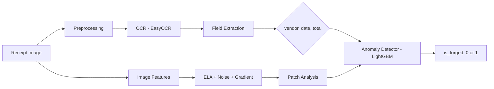

# DocFusion: Operation Intelligent Documents

**Rihal CodeStacker 2026 — ML Challenge**

An end-to-end intelligent document processing pipeline that extracts structured fields from scanned receipts and detects forged/tampered documents using OCR + ML-based anomaly detection.

## YouTube Demo

> **[Watch the Demo Video](https://youtube.com/YOUR_VIDEO_LINK_HERE)**

## Live Application (Cloud Deployment)

> **[Try it Live!](https://rihal-codestacker-ml.streamlit.app)**

## Architecture



### Pipeline Components

| Module | Description |
|--------|-------------|
| `src/preprocessing.py` | Image preprocessing: deskew, denoise, binarize, ELA, feature extraction |
| `src/ocr.py` | EasyOCR wrapper with line grouping and confidence filtering |
| `src/extraction.py` | Regex-based field extraction for vendor, date, total |
| `src/anomaly.py` | LightGBM anomaly detector with 40+ image and text features |
| `solution.py` | DocFusionSolution harness interface (train + predict) |
| `app.py` | Streamlit web UI for interactive analysis |

## Quick Start

### 1. Setup

```bash
git clone https://github.com/0xabdulraheem/rihal-codestacker-ml.git
cd rihal-codestacker-ml
python -m venv .venv
.venv\Scripts\activate
pip install -r requirements.txt
```

### 2. Generate Dummy Images

```bash
python scripts/generate_dummy_images.py
```

### 3. Run Local Validation

```bash
python check_submission.py --submission . --verbose
```

### 4. Launch Web UI

```bash
streamlit run app.py
```

### 5. Download Real Datasets

```bash
pip install datasets kagglehub
python scripts/download_datasets.py
```

## Challenge Levels

### Level 1: EDA
Jupyter notebook exploring dataset distributions, fraud types, and image features.
→ `notebooks/eda.ipynb`

### Level 2: Structured Information Extraction
Regex-based extraction of `vendor`, `date`, `total` from OCR text with fallback heuristics.
→ `src/extraction.py`

### Level 3: Anomaly Detection + Web UI
- **3A:** LightGBM classifier using 40+ features (ELA, patch ELA, noise, gradient, JPEG ghost detection)
- **3B:** Streamlit dashboard with upload, extraction, ELA visualization, and forgery scoring
→ `src/anomaly.py`, `app.py`

### Level 4: Harness Integration
`DocFusionSolution` class with `train()` and `predict()` methods, optimized for inference speed and memory.
→ `solution.py`

### Bonus
- **Dockerfile** for containerized deployment
- **Cloud deployment** via Streamlit Community Cloud
- **Intelligent anomaly summaries** — human-readable forensic explanations generated for each analysis

## Docker

```bash
docker build -t docfusion .
docker run -p 8501:8501 docfusion
```

## Project Structure

```
rihal-codestacker-ml/
├── solution.py
├── app.py
├── check_submission.py
├── requirements.txt
├── pyproject.toml
├── Dockerfile
├── src/
│   ├── __init__.py
│   ├── preprocessing.py
│   ├── ocr.py
│   ├── extraction.py
│   ├── anomaly.py
│   └── summarizer.py
├── notebooks/
│   └── eda.ipynb
├── scripts/
│   ├── generate_dummy_images.py
│   ├── download_datasets.py
│   ├── prepare_cord.py
│   ├── prepare_finditagain.py
│   ├── train_on_real_data.py
│   └── evaluate_model.py
└── dummy_data/
    ├── train/
    │   ├── train.jsonl
    │   └── images/
    └── test/
        ├── test.jsonl
        └── images/
```

## Tech Stack

| Category | Tools |
|----------|-------|
| OCR | EasyOCR |
| ML | LightGBM, scikit-learn |
| Image Analysis | OpenCV, PIL (ELA, edge detection) |
| Web UI | Streamlit |
| Data | pandas, numpy |
| Visualization | matplotlib, seaborn, plotly |

## Author

**0xabdulraheem** — Rihal CodeStacker 2026
