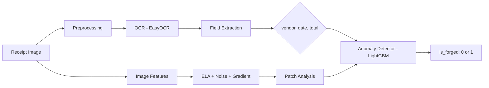

# DocFusion: Operation Intelligent Documents


**Rihal CodeStacker 2026 ML Challenge**

An end-to-end intelligent document processing pipeline that extracts structured fields from scanned receipts and detects forged/tampered documents using OCR + ML-based anomaly detection.

## YouTube Demo

> **[Watch the Demo Video](https://youtube.com/YOUR_VIDEO_LINK_HERE)**

## Cloud Deployment

> **[Try it Live!](https://rihal-codestacker-ml.streamlit.app)**

## Architecture



### Pipeline Components

| Module | Description |
|--------|-------------|
| `src/preprocessing.py` | Image preprocessing: deskew, denoise, binarize, ELA, 84 forensic features |
| `src/ocr.py` | EasyOCR wrapper with adaptive line grouping and confidence filtering |
| `src/extraction.py` | Field extraction for vendor, date, total with disambiguation and scoring |
| `src/anomaly.py` | LightGBM anomaly detector with 84 image, text, and OCR features |
| `src/summarizer.py` | Human-readable forensic anomaly summary generator |
| `solution.py` | DocFusionSolution harness interface (train + predict) |
| `app.py` | Streamlit web UI with batch upload, session history, and interactive analysis |

## Quick Start

### 1. Setup

```bash
git clone https://github.com/0xabdulraheem/rihal-codestacker-ml.git
cd rihal-codestacker-ml
python -m venv .venv
.venv\Scripts\activate
pip install -r requirements.txt
```

### 2. Generate Dummy Images

```bash
python scripts/generate_dummy_images.py
```

### 3. Run Local Validation

```bash
python check_submission.py --submission . --verbose
```

### 4. Launch Web UI

```bash
streamlit run app.py
```

### 5. Download Real Datasets

```bash
pip install datasets kagglehub
python scripts/download_datasets.py
```

## Challenge Levels

### Level 1: EDA
Jupyter notebook exploring dataset distributions, fraud types, and image features.
→ `notebooks/eda.ipynb`

### Level 2: Structured Information Extraction
Scored extraction of `vendor`, `date`, `total` from OCR text with:
- **Date disambiguation** (d/m/Y preferred; context keyword scoring)
- **OCR error correction** (O→0, l→1, S→5 in numeric contexts)
- **Confidence filtering** (low-confidence OCR tokens excluded)
- **Thousand-separator handling** (US and European formats)
- **Bottom-up total fallback** with multi-line detection
- **Vendor scoring** (uppercase/title-case preference, registration number skip, bbox width)

→ `src/extraction.py`

### Level 3: Anomaly Detection + Web UI
- **3A:** LightGBM classifier using 60+ features with **cross-validated threshold tuning**:
  - ELA at 3 quality levels (75/85/90) for JPEG ghost detection
  - DCT blockiness score (8×8 block boundary artifacts)
  - Regional noise inconsistency (4×4 grid noise CV)
  - LBP texture descriptors on ELA image
  - Noise residual features (Laplacian-based)
  - FFT frequency-domain analysis
  - OCR confidence metrics (mean, min, std, low-conf ratio)
  - Benford's Law deviation for total values
  - Corrupt image detection flag
- **3B:** Streamlit dashboard with:
  - Batch upload with summary table
  - **3-tier verdict system** (GENUINE / UNCERTAIN / SUSPICIOUS)
  - **Suspicious region heatmap overlay** (top ELA patches highlighted)
  - Session history in sidebar
  - Sample receipt buttons
  - Interactive confidence threshold slider

→ `src/anomaly.py`, `app.py`

### Level 4: Harness Integration
`DocFusionSolution` class with `train()` and `predict()` methods, optimized for inference speed and memory.
→ `solution.py`

### Bonus
- **Dockerfile** for containerized deployment (with health check and pre-baked OCR weights)
- **Cloud deployment** via Streamlit Community Cloud
- **Intelligent anomaly summaries**: human-readable forensic explanations with 12+ forensic indicators
- **Batch analysis**: upload multiple receipts and get a summary table
- **Suspicious region visualization**: bounding boxes on highest-ELA patches
- **Unit tests**: 38 pytest tests for extraction edge cases
- **Model metadata**: saved threshold, F1 score, feature count, and timestamp

## Docker

```bash
docker build -t docfusion .
docker run -p 8501:8501 docfusion
```

## Project Structure

```
rihal-codestacker-ml/
├── solution.py
├── app.py
├── check_submission.py
├── requirements.txt
├── pyproject.toml
├── Dockerfile
├── src/
│   ├── __init__.py
│   ├── preprocessing.py
│   ├── ocr.py
│   ├── extraction.py
│   ├── anomaly.py
│   └── summarizer.py
├── tests/
│   └── test_extraction.py
├── notebooks/
│   └── eda.ipynb
├── scripts/
│   ├── generate_dummy_images.py
│   ├── download_datasets.py
│   ├── prepare_cord.py
│   ├── prepare_finditagain.py
│   ├── train_on_real_data.py
│   └── evaluate_model.py
└── dummy_data/
    ├── train/
    │   ├── train.jsonl
    │   └── images/
    └── test/
        ├── test.jsonl
        └── images/
```

## Performance Metrics

*On Find-It-Again dataset (770 train / 218 test):*

| Metric | Training | CV (5-fold) |
|--------|----------|-------------|
| Accuracy | 94% | ~88% |
| F1 (Forged) | 0.71 | ~0.26–0.40 |
| Top Features | ela_max, ela_kurtosis, ela_diff_mean, ela_patch_std, noise_residual_kurtosis |

*Note: Metrics vary with dataset composition. The model uses automatic F1-maximizing threshold tuning.*

## Tech Stack

| Category | Tools |
|----------|-------|
| OCR | EasyOCR |
| ML | LightGBM, scikit-learn |
| Image Analysis | OpenCV, PIL (ELA, noise residuals, FFT, edge detection) |
| Web UI | Streamlit |
| Data | pandas, numpy |
| Visualization | matplotlib, seaborn, plotly |
| Testing | pytest |

## Author

**0xabdulraheem** . Rihal CodeStacker 2026
